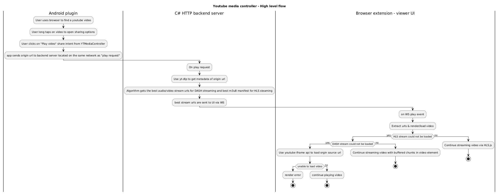

# YT-media-controller

### Build status

**Alpha build**

[Latest alpha build](https://github.com/Echo-Peak/YT-media-controller/releases/download/alpha-latest/YoutubeMediaControllerInstaller.exe)

**Beta build**

[Latest beta build](https://github.com/Echo-Peak/YT-media-controller/releases/download/beta-latest/YoutubeMediaControllerInstaller.exe)

**Stable build**

[Latest stable build](https://github.com/Echo-Peak/YT-media-controller/releases/download/stable-latest/YoutubeMediaControllerInstaller.exe)

## Preview

## What this project does

Playing YT videos via the website/app is quite frustrating to say the least.
This project attempts to bypass as much of the tracking / ads / interruptions
youtube enforces on those who do not have YT premium and/or using a ad-blocker.

This project consists of 3 projects that work in tandem to allow you to use your
android phone to send any Youtube video URL from any app to a computer
(dedicated host) to play said video.

## System Requirements

- Android 13+
- Windows 11
- Chromium based browser

## Component overview

This project consists of 3 components:

**The mobile plugin**

Currently only supports Android.  
This lightweight app enhances the Android share menu by adding two options:

- Send URL to YT Controller
- Queue URL to YT Controller

When either action is triggered (usually via a long press), the app:

- Validates that the shared URL is from YouTube.
- Sends the URL to the Windows service using the endpoint
  `POST http://DEVICE_IP:PORT/mobile/playVideo`.

**The C# backend server**

This Windows service runs under the "Local Network" service account to minimize
permissions. It hosts two servers:

- An HTTP server for communication with external devices (e.g., the Android
  app).
- A WebSocket control server for internal communication with the browser
  extension.

The Android app interacts with the HTTP server by sending a `playVideo` request
that includes the original YouTube URL from the `SHARE_INTENT` action.

**The external viewer (UI / browser extension)**

The browser extension is a 3-part component that allows communication with an
external C# HTTP server and WebSocket server so that the mobile app can send a
YT link and have it play within the UI.

The parts are as follows:

- **The external viewer**
  - This is the UI that can play HLS, DASH, and YouTube iframe videos.
  - This viewer communicates with the C# backend server via a local WebSocket
    connection.

- **The mobile setup**
  - This is a UI that renders a QR code containing the device's local network IP
    and the port of the C# HTTP server.

These three components are designed to enable seamless sending of YouTube video
URLs from an Android device—via a "long-press" on video content. The idea is to
send a YouTube video to a designated PC, like an HTPC, without the analytics
gathering that occurs during casting or affecting the YouTube recommendation
feed of your personal account.

**High-level architecture** 

## Usage for end-users

**Note** Because the app/assets are unsigned, you may have issues downloading
the installer. You may need to whitelist or disable your AV temporarily then
re-enable once installed

**Download the installer**

Go to [releases section](https://github.com/Echo-Peak/YT-media-controller/tags)
and choose which channel/environment you would like to install.

There are 3 "channels" to choose from. Alpha channel being the least stable.

- Alpha
- Beta
- Stable

Install the EXE installer.

**Install the APK**

Either install the .apk file via side-loading. To do this, you will need to go
to Settings > Security and select "Allow untrusted sources" then re-download the
.apk to install. After install, **make sure** you disable "Allow untrusted
sources" option!

If you have android studio installed on computer or at the very least a android
SDK environment, you can use `adb` to install the app.

- Download the .apk file
- open Command Prompt and check if `abd` is installed by typing `abd` and press
  enter
- On your android device, you will need to have it in "developer mode". To do
  this, it will vary by device manufacture, its usually done by opening
  Settings > About phone > Software information and tapping Build number 7
  times.
- Once device has been setup for developer mode, enable USB debugging via
  developer options. To do this, open Settings and scroll all the way to the
  bottom, you should see something like "Developer options". Open it and scroll
  slowly to find "USB debugging" and enable it.
- Plug in your android device to your computer. You should see a "Allow this
  device" prompt on the android device after a few seconds. Make sure you press
  allow.
- Back in command prompt, type `adb list` and press enter. You should see your
  device listed.
- Install the apk on the device by running `abd install <apk path>`. Copy/Paste
  the path of the .apk file downloaded and replace <apk path\> with it. e.g:
  `abd install C:\downloads\app-release-unsigned.apk`

**Installing the browser extension**

- After the app is installed. There is one more step that is needed.
- In your browser of choice, must be chromium based, go to Settings >
  Extensions > Manage extensions and enable Developer mode
- Click on "Load unpacked" and navigate to
  `C:\Program Files (x86)\YTMediaController\BrowserExtension` and click Select
  folder.

**Linking mobile to host**

- On the computer/host, Right-click on extension icon and select Configure
  Mobile plugin option
- On your android phone, open the YTMediaController app and tap on the camera
  view-box to load the QR code scanner.
- Point camera at the QR code thats displayed on the computer to link your
  phone.

**Testing**

- When all previous steps have been done, you should now be able to play/send
  any youtube link on your android device to the computer to be played without
  any ads / interruptions / tracking.
- Open a browser and find a youtube video you want to try. Hold tap on the video
  to open the context menu and select share.
- You should see YTMediaController as an option with the "Play video" as a
  action. Select on "Play video".
- Watch as the video will be playing on the computer within a couple seconds.

**Configurability**

There are a number of config options to change the behavior of the app. These
settings are located in the registry at this path:
`HKEY_LOCAL_MACHINE\SOFTWARE\WOW6432Node\YTMediaController`.

These are the possible settings:

- **backendServerPort** - Change the background HTTP server port. Changing this
  will require service restart.
- **uiSocketServerPort** - Change the IPC port between the UI and background
  service. Changing this will require service restart.
- **disableAutoUpdate** - If set to "true", it will disable the auto updater.
- **autoUpdateIntervalMins** - Changes how often the updater checks for an
  update. This is in minutes. Default is 4 hours (240 mins)
- **autoUpdateChannel** - Changes what update channel/environment to choose
  from. Use this if you want to go from "alpha" to "stable" if you want a more
  stable build. Its possible values are: "alpha", "beta", "stable"

Restarting the background service
`net stop YTMediaControllerService && net start YTMediaControllerService`

**Uninstalling**

Currently, the only way to uninstall the app is to use the
`YoutubeMediaControllerUninstaller.exe` located in `C:\Program Files (x86)`. You
will need to open a Command prompt with administrator privileges and copy/paste
the path of the uninstaller (must include double quotes) and press enter.

Like this:
`"C:\Program Files (x86)\YTMediaController\YoutubeMediaControllerUninstaller.exe" /S`

## Local Setup (for developers)

**Requirements**

- VS 2022+
- C# build environment
- .NET Framework 4.8
- NSIS 2.x
- Chromium based browser (brave, chrome, edge)

**Setup**

- Clone the repo
- Run `yarn`
- Run `node ./backend/scripts/installExternalDeps.js`
- Open `./backend/YTMediaControllerSrv/YTMediaController.sln` and rebuild
  solution
- Run `yarn package`
- Open generated installer in `dist` folder

## License

This project is licensed under the [MIT License](./LICENSE).
